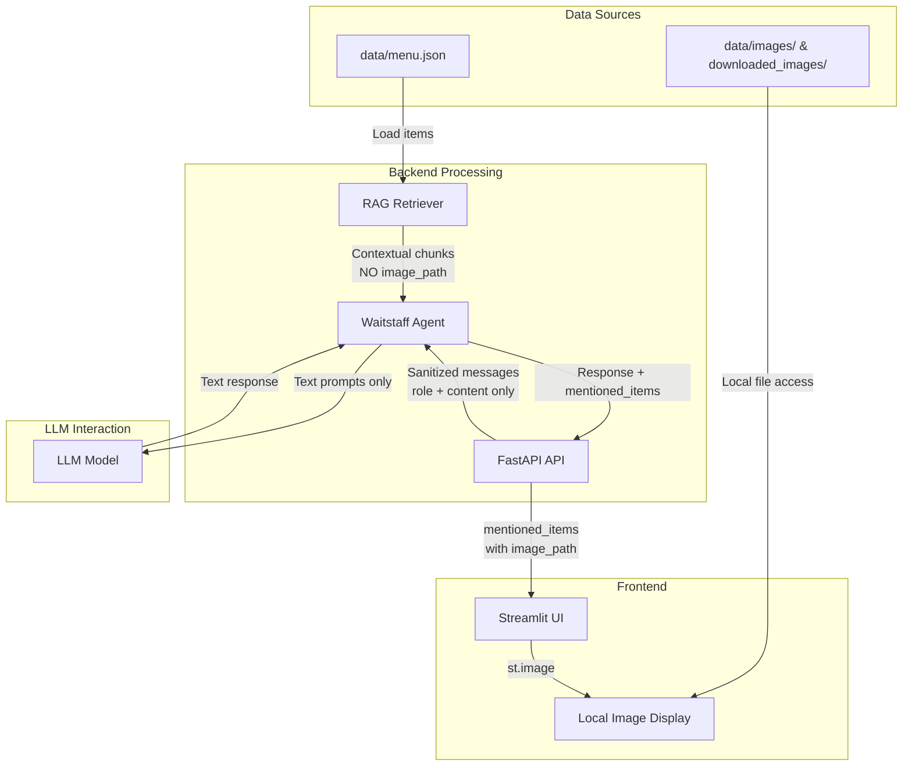

# Image & Menu Data Flow Architecture

## Overview
This document describes how menu items and images are handled throughout the GAC Waiter system. **Critical Design Principle**: Images are used exclusively for local UI display and are **never sent to the LLM**.

## Data Flow Diagram



## Key Components

### 1. Message Sanitization (`backend/api.py`)

**Location**: Lines 69-72

Before any message is sent to the LLM, it is sanitized to extract only `role` and `content`:

```python
clean_messages = []
for msg in request.messages:
    clean_msg = {"role": msg.get("role"), "content": msg.get("content")}
    clean_messages.append(clean_msg)
```

**Why This Matters**: The frontend stores `showcase_items` (containing `image_path`) in conversation messages for UI rendering. This sanitization ensures those fields are stripped before LLM processing.

---

### 2. RAG Contextual Chunks (`backend/rag_retriever.py`)

**Location**: Lines 111-135

When creating searchable chunks for the embedding model, `image_path` is **explicitly excluded**:

```python
def _create_contextual_chunk(self, item: Dict[str, Any]) -> str:
    # Menu Item chunk structure
    chunk = f"""This menu item is from {restaurant_info}.
    Category: {item.get('category', 'Other')}
    Item Name: {item.get('item_name', 'Unknown')}
    Vietnamese Name: {item.get('item_viet', '')}
    Price: ${item.get('price', 0):.2f}
    {f"[POPULAR ITEM]" if item.get('popular') else ""}
    Description: {item.get('description', '')}
    """
    return chunk.strip()
```

**Included Fields**:
- Category, Item Name, Vietnamese Name, Price, Description, Popular status

**Excluded Fields**:
- `image_path`, `pronunciation` (not relevant for semantic search)

---

### 3. Menu Item Retrieval Flow

When a user asks about menu items:

1. **Query Processing**: User message is sent to RAG retriever
2. **Hybrid Search**: Semantic (FAISS) + Keyword (BM25) search
3. **Full Item Return**: Retrieved items include ALL fields (including `image_path`)
4. **Agent Processing**: Agent uses text fields for LLM context
5. **API Response**: Returns `mentioned_items` with full item data
6. **Frontend Display**: Uses `image_path` for local `st.image()` calls

---

### 4. Image Display Flow (`app.py`)

**Location**: Lines 277-315

Images are displayed **locally** using Streamlit's `st.image()`:

```python
if "showcase_items" in msg and msg["showcase_items"]:
    for item in msg["showcase_items"]:
        img_path = item.get('image_path')
        if img_path:
            # Normalize path
            if img_path.startswith('./images/'):
                img_path = img_path.replace('./images/', 'data/images/')
            elif img_path.startswith('./downloaded_images/'):
                img_path = img_path.replace('./downloaded_images/', 'data/downloaded_images/')
            
            if os.path.exists(img_path):
                st.image(img_path, use_container_width=True)
```

**Key Points**:
- `st.image()` is a local file operation
- No network calls to LLM for image rendering
- Path normalization handles different storage locations

---

### 5. Conversation State Storage

When storing assistant responses in conversation history:

```python
st.session_state.conversation.append({
    "role": "assistant", 
    "content": text,                  # Text for LLM
    "showcase_items": showcase_items, # For local UI only
    "images": []                      # Legacy field
})
```

**Critical**: While `showcase_items` is stored, it's stripped by the API sanitization before LLM calls.

---

## Image Storage Locations

| Directory | Purpose | Source |
|-----------|---------|--------|
| `data/images/` | Original menu images | Manual upload |
| `data/downloaded_images/` | Web-sourced images | Image download script |

---

## Security Guarantees

1. **No Image Data to LLM**: Images are never encoded, embedded, or sent to the LLM API
2. **Text-Only LLM Context**: RAG chunks contain only textual menu information
3. **Local Rendering**: All image display happens via local file system access
4. **Path Sanitization**: Message cleaning removes any image-related fields before LLM calls

---

## Verification Checklist

To verify images are not sent to LLM:

- [ ] Check `api.py` lines 69-72 for message sanitization
- [ ] Verify `rag_retriever.py` `_create_contextual_chunk()` excludes `image_path`
- [ ] Confirm `app.py` uses `st.image()` for local rendering
- [ ] Review API logs for message content (should only show role/content)

---

## Related Documentation

- [System_Design.md](./System_Design.md) - Overall architecture
- [RAG_Integration.md](./RAG_Integration.md) - Retrieval system details
- [UI_Design_Guide.md](./UI_Design_Guide.md) - Frontend styling
