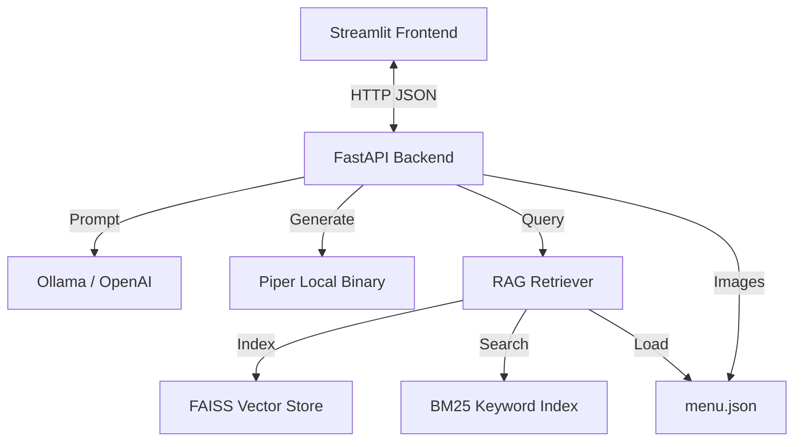

# Restaurant Waiter App Design Specification

## 1. Project Overview
This design specification outlines a Voice-Enabled Digital Waiter application for "Garlic & Chives". The waiter, **Kristin**, simulates a polite, knowledgeable restaurant server, integrating intelligent ordering, upselling, and safety protocols (allergy checks).

The system uses a **Client-Server Architecture** to support scalability and multiple client instances (e.g., table tablets, kiosks).
- **Backend**: FastAPI service managing logic, LLM integration (OpenRouter/Ollama), On-Demand Multi-Language Text-to-Speech (Piper), RAG-based Menu Retrieval, and Menu Data.
- **Frontend**: Streamlit web application providing a rich, visual user interface with on-demand audio playback.

**Key Goals**:
- **Scalability**: Decoupled Client/Server allowing multiple UIs to connect to one central brain.
- **Safety**: Strict workflows for allergy verification and order confirmation.
- **Menu Accuracy**: RAG (Retrieval-Augmented Generation) system prevents hallucinations and ensures only real menu items are recommended.
- **Efficiency**: 99% token reduction through targeted retrieval instead of full menu embedding.
- **Rich Experience**: Visual menu grid with side-by-side image/description layout, real-time voice synthesis, and bilingual menu display.
- **Multi-Language**: Full support for English, Vietnamese, Chinese, and Spanish (text + voice).
- **POS Ready**: Structured checkout data generation with validation.

## 2. Requirements
### Functional Requirements
- **Menu System**:
  - Load from `menu.json`.
  - Support Categories (Seafood, Meat, etc.).
  - Highlight [POPULAR] items.
  - **RAG-based Retrieval**: Hybrid search (semantic + keyword) for accurate item retrieval.
  - **Validation Layer**: Ensures no hallucinated items in final orders.
  - **Token Efficiency**: Retrieve only 3-5 relevant items per query instead of embedding entire menu.
- **Conversational Agent**:
  - Workflow: Explore -> Check Allergies -> Confirm Order -> Finalize.
  - Persona: Kristin - Friendly, helpful, knowledgeable waiter.
- **Voice Interaction**:
  - **On-Demand TTS**: User clicks 🔊 button to hear waiter responses.
  - **Multi-Language Support**: English, Vietnamese, Chinese (Mandarin), and Spanish.
  - **Piper TTS**: Local, low-latency voice synthesis with language-specific models.
  - **Markdown Stripping**: Removes formatting symbols for natural speech.
  - **Continuous Speech**: Speaks through entire message without stopping at line breaks.
  - Speech-to-Text (STT) ready (via UI hooks).
- **Bilingual Menu Display**:
  - In Vietnamese mode, menu items show Vietnamese names first with English secondary.
  - Pronunciation guides included for Vietnamese dishes.
  - Labels translated (e.g., [PHỔ BIẾN] instead of [POPULAR]).
- **Ordering**:
  - Cart management via conversation.
  - POS Integration endpoint (`/v1/checkout`) returning JSON order summary.

### Non-Functional Requirements
- **Latency**: Near real-time audio generation.
- **Configuration**: Environment variables for Ports, Hosts, and LLM endpoints.
- **Deployment**: Single script (`start.sh`) orchestration.

## 3. Architecture
The app follows a **Client-Server** model:



### 3.1 Backend Service (`backend/api.py`)
- **Framework**: FastAPI.
- **Port**: Default `8000`.
- **Responsibilities**:
  - **Menu Manager**: Parses JSON, handles categories/popularity logic.
  - **RAG Retriever**: Hybrid search (semantic + BM25) for menu item retrieval.
  - **LLM Client**: Manages conversation history, injects system prompts with retrieved items, enforces workflow constraints. Waiter persona is "Kristin".
  - **TTS Client**: On-demand multi-language audio generation.
    - 4 supported languages: English, Vietnamese, Chinese (Mandarin), Spanish
    - Markdown stripping for clean speech
    - Continuous speech through line breaks
    - Language-specific caching
  - **Order Parsing**: Extracts structured order data using LLM.
  - **Validation**: Ensures all ordered items exist in menu (prevents hallucinations).

### 3.2 Frontend Client (`app.py`)
- **Framework**: Streamlit.
- **Port**: Default `8501`.
- **Responsibilities**:
  - **Visuals**: Renders Menu Grid with images and "Ask/Order" buttons.
  - **Audio**: On-demand audio playback via 🔊 speak button next to each waiter message.
  - **Audio Caching**: Stores generated audio in session state to avoid regeneration.
  - **Interaction**: Chat interface and Checkout button.

### 3.3 RAG Retriever (`backend/rag_retriever.py`)
- **Framework**: sentence-transformers + FAISS + BM25.
- **Responsibilities**:
  - **Indexing**: Load menu, create contextual chunks, generate embeddings, build search indexes.
  - **Retrieval**: Hybrid search combining semantic similarity and keyword matching.
  - **Validation**: Verify ordered items exist in menu.
- **Performance**: <100ms retrieval latency, 99% token reduction.

## 4. Workflows

### 4.1 Waiter Logic
1.  **Exploration**: User asks about items. Waiter explains ingredients/flavors using RAG-retrieved menu data.
2.  **Ordering**: User selects items. Waiter upsells.
3.  **Safety Check**: **CRITICAL** - Waiter asks for allergies before proceeding.
4.  **Confirmation**: Waiter reads back the entire order with prices.
5.  **Finalization**: User confirms.

### 4.2 Checkout Logic
1.  User clicks "Request Check".
2.  Frontend calls `POST /v1/checkout`.
3.  Backend sends conversation history to LLM with "Order Parser" prompt.
4.  LLM returns JSON: `{ "order": [...], "allergies": [...], "total": ... }`.
5.  **Validation**: Backend validates all items exist in menu, filters invalid items.
6.  Frontend displays summary.

### 4.3 RAG Retrieval Flow
1.  User sends message: "Do you have spicy seafood?"
2.  Backend extracts query from message.
3.  RAG Retriever performs hybrid search:
    - Semantic search: Find similar items by embedding
    - BM25 search: Find items with matching keywords
    - Rank fusion: Combine results with weighted scoring
4.  Return top 5 relevant items to LLM context.
5.  LLM generates response using only retrieved items.

## 5. Components & Data
### 5.1 Menu Data (`menu.json`)
- **Structure**:
  ```json
  {
    "items": [
      {
        "item_name": "Vegetarian Chowfun",
        "item_viet": "Ap Chao Chay",
        "pronunciation": "ahp chow chy",
        "description": "Sautéed flat rice noodles with tofu...",
        "description_viet": "Hủ tiếu xào chay...",
        "price": 18,
        "category": "Rice & Noodles",
        "popular": false,
        "image_path": "./downloaded_images/Vegetarian_ChowfunAp_Chao_Chay.jpg"
      }
    ]
  }
  ```
- **Fields**:
  - `item_name`: English name (primary identifier)
  - `item_viet`: Vietnamese name (optional)
  - `pronunciation`: Phonetic pronunciation for Vietnamese name (optional)
  - `description`: English description
  - `description_viet`: Vietnamese description (optional)
  - `image_path`: Relative path to item image

### 5.2 Configuration (`.env`)
- `LLM_BASE_URL`: Endpoint for intelligence.
- `BACKEND_URL`: URL for API.
- `APP_PORT` / `API_PORT`: Configurable ports.
- `MENU_PATH`: Path to data/menu.json.
- `PIPER_BINARY`: Path to Piper TTS binary.
- `PIPER_MODEL_EN`: Path to English voice model.
- `PIPER_MODEL_VI`: Path to Vietnamese voice model.
- `PIPER_MODEL_ES`: Path to Spanish voice model.
- `PIPER_MODEL_ZH`: Path to Chinese (Mandarin) voice model.

### 5.3 Dependencies
**RAG**:
- `sentence-transformers>=3.0.0`: Embedding model
- `faiss-cpu>=1.8.0`: Vector similarity search
- `rank-bm25==0.2.2`: Keyword search

**TTS**:
- `langdetect`: Automatic language detection
- Piper binary with ONNX models:
  - `en_US-amy-medium.onnx` (English)
  - `vi_VN-vais1000-medium.onnx` (Vietnamese)
  - `es_ES-sharvard-medium.onnx` (Spanish)
  - `zh_CN-huayan-medium.onnx` (Chinese Mandarin)

## 6. Operations
- **Start**: `./scripts/start.sh` (Launches API then UI).
  - RAG indexing happens automatically on API startup (~10 seconds).
- **Monitor**: Check `api.log` and `app.log`.
- **Stop**: `./scripts/stop.sh`.

## 7. RAG Integration Details

### 7. RAG Integration Details
 
See [`docs/components/02_RAG_System.md`](../../docs/components/02_RAG_System.md) for comprehensive documentation on:
- RAG architecture and components
- Indexing and retrieval algorithms
- Validation and hallucination prevention
- Performance metrics and benefits
- Future enhancements (Phase 2 & 3)

## 8. TTS System Details

### 8. TTS System Details
 
See [`docs/components/03_TTS_System.md`](../../docs/components/03_TTS_System.md) for comprehensive documentation on:
- On-demand audio generation architecture
- Multi-language support (English, Vietnamese, Chinese, Spanish)
- Automatic language detection
- Markdown stripping and text processing
- Caching strategy
- API endpoints and implementation

## 9. UI Design System

### 9. UI Design System
 
See [`docs/components/04_UI_Design.md`](../../docs/components/04_UI_Design.md) for the interface specification:
- **Theme**: "Garlic & Chives" Green (#4CAF50) & Dark Mode
- **Typography**: Playfair Display (Headers) + Inter (Body)
- **Components**: Custom CSS for buttons, chat bubbles, and layout

## 10. Image & Data Flow

### 10. Image & Data Flow
 
See [`docs/architecture/02_Data_Flow.md`](./02_Data_Flow.md) for documentation on:
- **Data Flow Architecture**: How menu items and images flow through the system
- **LLM Isolation**: Images are NEVER sent to the LLM - used only for local UI display
- **Message Sanitization**: How conversation data is cleaned before LLM calls
- **RAG Chunk Structure**: Text-only contextual chunks for retrieval
- **Image Storage**: Location and organization of menu images